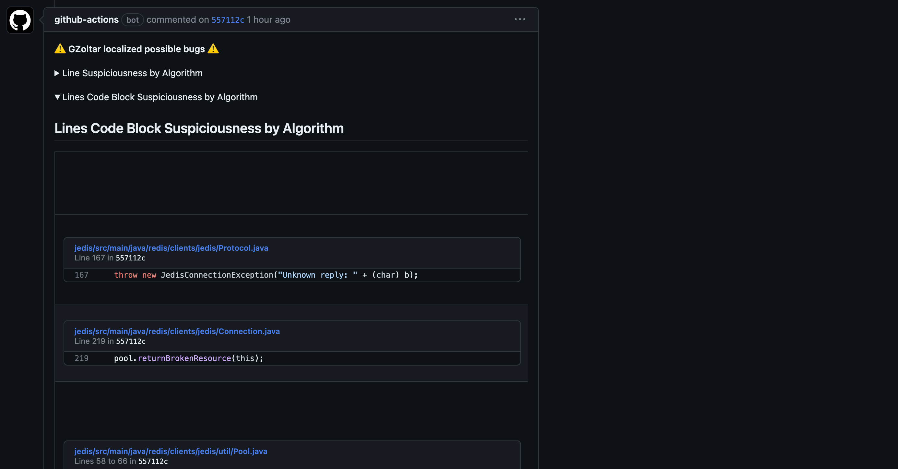
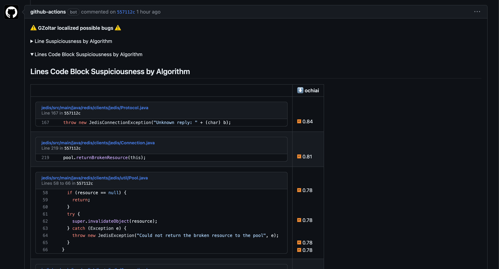

# 📚 GZoltar Automatic Feedback for GitHub Actions

Analyzes GZoltar results and posts a comment on the pull request/commit with the suspicious lines.

## Action inputs

| Name                      | Description                                                                                                                                                                                                                                                                                                                                                                                                     | Default       |
|---------------------------|-----------------------------------------------------------------------------------------------------------------------------------------------------------------------------------------------------------------------------------------------------------------------------------------------------------------------------------------------------------------------------------------------------------------|---------------|
| `token`                   | Personal access token (PAT) used to make actions on the repository such as creating comments on PRs/Commits. It is recommended to use a service account with the least permissions necessary. Also when generating a new PAT, select the least scopes necessary. [Learn more about creating and using encrypted secrets](https://help.github.com/en/actions/automating-your-workflow-with-github-actions/creating-and-using-encrypted-secrets) | `${{ github.token }}` |
| `build-path`              | Path to the build/target directory containing the GZoltar results                                                                                                                                                                                                                                                                                                                                               | `/build`      |
| `serialized-coverage-file-path` | Path to the file containing the serialized file with the coverage collect by GZoltar. Example: `/build/gzoltar.ser`                                                                                                                                                                                                                                                                                                 | Not required  |
| `test-cases-file-path`    | Path to the file containing a list of all test cases identified by GZoltar. Example: `/build/sfl/txt/tests.csv`                                                                                                                                                                                                                                                                                                     | Not required  |
| `spectra-file-path`       | Path to the file containing a list of all lines of code identified by GZoltar (one per row) of all classes under test. Example: `/build/sfl/txt/spectra.csv`                                                                                                                                                                                                                                                 | Not required  |
| `matrix-file-path`        | Path to the file containing a binary coverage matrix produced by GZoltar. Example: `/build/sfl/txt/matrix.txt`                                                                                                                                                                                                                                                                                                   | Not required  |
| `statistics-file-path`    | Path to the file containing statistics information of the ranking produced by GZoltar. Example: `/build/sfl/txt/statistics.csv`                                                                                                                                                                                                                                                                                  | Not required  |
| `ranking-files-paths`     | Path to each SFL ranking algorithms file. Example: `[/build/sfl/txt/ochiai.ranking.csv]`                                                                                                                                                                                                                                                                                                                        | Not required  |
| `ranking-html-directories-paths`     | Path to each SFL ranking algorithms directory containing the HTML reports. Example: `[/build/sfl/html/ochiai/]`                                                                                                                                                                                                                                                                                                                        | Not required  |
| `sfl-ranking`             | List of the SFL ranking algorithms to use separated by `,`. (Keep in mind that each algorithm need to have present a fault localization report file in the `ranking-files-path` directory with his name, i.e. `ochiai.ranking.csv`.)                                                                                                                                                                             | `[ochiai]`    |
| `sfl-threshold`           | Line suspiciousness threshold to trigger an warning. A threshold is needed for each SFL ranking algorithms used                                                                                                                                                                                                                                                                                                 | `[0.5]`       |
| `sfl-ranking-order`           | Ranking algorithm to order table results by suspiciousness, on descending order.                                                                                                                                                                                                                                                                                                 | `ochiai`       |
| `diff-comments-code-block`           | Indicates if comments displayed on files with suspicious lines in diff are grouped by code block, instead of in each line                                                                                                                                                                                                                                                                                                 | `true`       |
| `upload-artifacts`        | Indicates whether to upload the GZoltar results as an artifact                                                                                                                                                                                                                                                                                                                                                    | `false`       |


## Usage

Executing Automatic Feedback Action after GZoltar Fault Localization:

```yaml
name: GZoltar Fault Localization
on: [push]
jobs:
  fault-localization:
    name: Fault Localization
    runs-on: ubuntu-latest
    permissions:
      contents: write
      pull-requests: write
    steps:
    - uses: actions/checkout@v3
    - name: Executes GZoltar fault-localization on a Java project using CLI
      run: ./run_gzoltar.sh
    - name: Executes GZoltar Automatic Feedback for GitHub Actions to get summarized view
      uses: hugofpaiva/gzoltar-feedback-action@main
      with:
        sfl-ranking: "[ochiai, tarantula]"
        sfl-threshold: "[0.5, 0.85]"
        sfl-ranking-order: "ochiai"
        upload-artifacts: true
```

> **Note:** `contents` and `pull-requests` write permissions are needed to create comments on both commits and pull requests

## Example

A repository with a detailed example can be found [here](https://github.com/hugofpaiva/example-gzoltar-feedback-action).

## Limitations

- **Node Memory Usage**

  This action loads all the content resulting from the GZoltar processing into memory. This is necessary to quickly analyze possible faults and provide the maximum amount of information to the user.

  Although optimizations have been made to avoid excessive memory usage, it can happen. In case of errors in the pipeline related to this, it is always possible to increase the memory of the node in the action step using the `NODE_OPTIONS` environment variable:
  ```yaml
  ...
  - name: Executes GZoltar Automatic Feedback for GitHub Actions to get summarized view
      uses: hugofpaiva/gzoltar-feedback-action@main
      env:
        NODE_OPTIONS: "--max-old-space-size=16384"
      with:
        sfl-ranking: "[ochiai, tarantula]"
        sfl-threshold: "[0.5, 0.85]"
        sfl-ranking-order: "ochiai"
        upload-artifacts: true
  ```
  In this example, the memory of the node is increased to 16GB, instead of the default 512 MB.

- **Main Comment String Length of a Commit/Pull Request**

  GitHub has a limit of 65536 characters for the main comment of a commit/pull request. This limit is not related to the action, but to the GitHub API itself. If the limit is exceeded, the action will fail.
  
  The main comment string can get quite long because in the case of the `Line Suspiciousness by Algorithm` analysis, the tests that covered a given line are shown, including the **stacktrace** in case the test failed. To try to solve this problem, the maximum size of the stacktrace was reduced to 300 chars, placing `...` when this is exceeded. If this problem recurs in several environments, it is always possible to reduce this size or even put it as an action input.

- **Comment area size**
  
  GitHub assigns a maximum width of 780px in the comments area. Although this may be sufficient for most cases, when there are long lines of code, the table can be unformatted, making it difficult to understand its content.

  To solve this problem, a simple JavaScript script needs to be executed in the browser console so that the maximum width size is increased. The results are shown in the following image:

  Before:
  

  After:
  

  The script to be executed is the following:
  ```javascript
  // Find the div element with id "comments" 
  var commentsDiv = document.getElementById("comments"); 
  // Check if the div element exists 
  if (commentsDiv) { 
    // Set the maxWidth of the div element to 2000px 
    commentsDiv.style.maxWidth = "2000px"; 
  }
  ```
